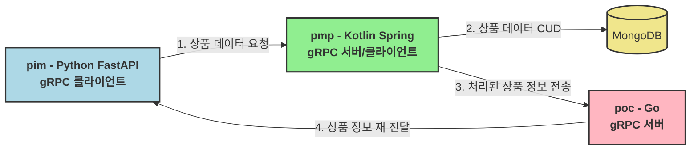

# PMP Product Management Platform
PMP는 상품 관리 플랫폼으로, 상품 데이터의 CUD(Create, Update, Delete) 작업을 수행합니다.   
PMP는 gRPC 서버와 클라이언트로 구성되어 있으며, MongoDB를 데이터베이스로 사용합니다.

## 기술 스택
- **Backend**: Kotlin, Spring Boot gRPC
- **Database**: MongoDB

# PIM Product Information Management
PIM은 상품 정보 관리 시스템으로, 상품 데이터를 요청하고 처리된 상품 정보를 수신합니다.   
PIM은 FastAPI로 구현되어 있으며, gRPC 서버와 클라이언트로 작동합니다.

## 기술 스택
- **Backend**: Python, FastAPI gRPC

# POC Product Observation Confirmation
POC는 상품 관찰 확인 시스템으로, 처리된 상품 정보를 수신하고 이를 확인합니다.   
POC는 Go로 구현되어 있으며, gRPC 서버와 클라이언트로 작동합니다.

## 기술 스택
- **Backend**: Go, gRPC

