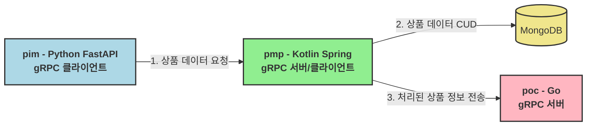

```mermaid
graph LR
    PIM[pim - Python FastAPI<br>gRPC 클라이언트] -->|1. 상품 데이터 요청| PMP[pmp - Kotlin Spring<br>gRPC 서버/클라이언트]
    PMP -->|2. 상품 데이터 CUD| MONGODB[(MongoDB)]
    PMP -->|3. 처리된 상품 정보 전송| POC[poc - Go<br>gRPC 서버]

    style PIM fill:#ADD8E6,stroke:#333,stroke-width:2px
    style PMP fill:#90EE90,stroke:#333,stroke-width:2px
    style POC fill:#FFB6C1,stroke:#333,stroke-width:2px
    style MONGODB fill:#F0E68C,stroke:#333,stroke-width:2px

    classDef service color:#333,font-weight:bold
    class PIM,PMP,POC service
```