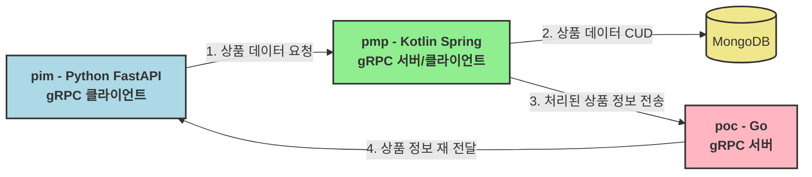

# Reactive gRPC Example

여러 언어로 작성된 gRPC 서비스를 사용해 상품 데이터를 관리하는 예제 프로젝트입니다.

## Architecture


```mermaid
graph LR
    PIM[pim - Python FastAPI<br>gRPC 클라이언트] -->|1. 상품 데이터 요청| PMP[pmp - Kotlin Spring<br>gRPC 서버/클라이언트]
    PMP -->|2. 상품 데이터 CUD| MONGODB[(MongoDB)]
    PMP -->|3. 처리된 상품 정보 전송| POC[poc - Go<br>gRPC 서버]
    POC -->|4. 상품 정보 재 전달| PIM

    style PIM fill:#ADD8E6,stroke:#333,stroke-width:2px
    style PMP fill:#90EE90,stroke:#333,stroke-width:2px
    style POC fill:#FFB6C1,stroke:#333,stroke-width:2px
    style MONGODB fill:#F0E68C,stroke:#333,stroke-width:2px

    classDef service color:#333,font-weight:bold
    class PIM,PMP,POC service
```

## Components

### PMP Product Management Platform
PMP는 상품 관리 플랫폼으로, 상품 데이터의 CUD(Create, Update, Delete) 작업을 수행합니다. Kotlin과 Spring Boot gRPC로 작성되어 있으며 MongoDB를 사용합니다.

### PIM Product Information Management
PIM은 FastAPI 기반의 gRPC 서비스로, 상품 데이터를 요청하고 처리된 상품 정보를 수신합니다.

### POC Product Observation Confirmation
POC는 Go로 구현된 gRPC 서비스로, PMP에서 전달된 상품 정보 결과를 확인하고 다시 PIM으로 전달합니다.

## Getting Started

### 1. Infrastructure (MongoDB)

```bash
cd infra
docker-compose up -d
```

MongoDB 클러스터가 준비되면 `infra/README.md`에 있는 명령어를 참고하여 replica set과 shard를 초기화합니다.

### 2. Generate gRPC code

- **Python**

```bash
cd pim
python -m grpc_tools.protoc -I. --python_out=. --pyi_out=. --grpc_python_out=. ./src/proto/product.proto
```

- **Kotlin**

Gradle 플러그인이 자동으로 코드를 생성합니다.

```bash
cd pmp
./gradlew build
```

- **Go**

```bash
cd poc
protoc --go_out=. --go-grpc_out=. ../proto/product.proto
```

### 3. Run Services

```bash
# PIM (FastAPI)
cd pim
uvicorn src.main:app --reload

# PMP (Spring Boot)
cd ../pmp
./gradlew bootRun

# POC (Go)
cd ../poc
go run ./cmd/main.go
```

세 서비스가 실행되면 gRPC를 통해 서로 통신하며 상품 데이터를 처리합니다.

## License
MIT
